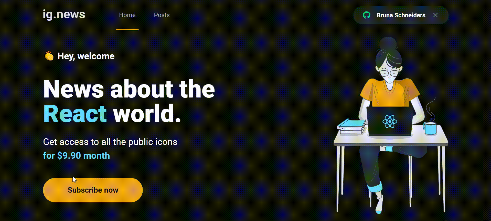

<h1 align="center">ig.news - aplicação de assinatura de conteúdo 👋</h1>

<p align="center"><b>Status: Concluído ✔</b></p>

## 📄 Sobre

<p> 🚀 Aplicação de assinatura de conteúdo desenvolvida durante a aula de Fundamentos do Next do Ignite.</p>

## 🔝 Features

- [x] Autenticação pelo GitHub;
- [x] Inscrição/assinatura para consumir conteúdo;
- [x] Listagem de posts cujo conteúdo só pode ser acessado integralmente por assinantes.
- [x] Visualização do post completo
- Autenticação pelo GitHub
  

- Inscrição/assinatura para consumir conteúdo e listagem de posts
  

- Visualização do post completo
  

## 🛠 Tecnologias

As seguintes tecnologias foram utilizadas na construção deste projeto:

- [React](https://pt-br.reactjs.org/)
- [NextJS](https://nextjs.org/)
- [Typescript](https://www.typescriptlang.org/)
- [SASS](https://sass-lang.com/)
- [Testing Library](https://testing-library.com/)

Além disso, a aplicação também foi conectada a alguns serviços externos:

- [STRIPE](https://stripe.com/br) - Serviço de pagamentos;
- [FAUNADB](https://fauna.com/) - Banco de dados focado em aplicações Serverless;
- [Prismic CMS](https://prismic.io/)

## 🚀 Como executar o projeto

### Pré-requisitos

Antes de começar, você vai precisar ter instalado em sua máquina as seguintes ferramentas:
[Git](https://git-scm.com), [Node.js](https://nodejs.org/en/).
Além disto é bom ter um editor para trabalhar com o código como [VSCode](https://code.visualstudio.com/)

### 🧭 Rodando a aplicação web

```bash
# Clone este repositório
$ git clone https://github.com/brunaschneiders/ignite-reactjs-ignews.git

# Acesse a pasta do projeto no seu terminal/cmd
$ cd ignite-reactjs-ignews

# Instale as dependências
$ yarn install

# Execute a aplicação em modo de desenvolvimento
$ yarn dev

# A aplicação será aberta na porta:3000 - acesse http://localhost:3000
```

## Autor

👤 **Bruna Schneiders**

- Github: [@brunaschneiders](https://github.com/brunaschneiders)
- LinkedIn: [@bruna-schneiders](https://linkedin.com/in/bruna-schneiders)
